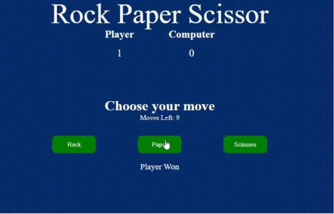

# Rock Paper and Scissor Game using HTML,CSS & JavaScript

Rock, paper, and scissors game is a simple fun game in which both players have to make a rock, paper, or scissors. It has only two possible outcomes a draw or a win for one player and a loss for the other player.

## Prerequisites:
1. HTML
2. CSS
3. JavaScript

## Approach
1. Start by creating the HTML structure for your Rock, Paper, and Scissor Game
2. Style your website using CSS to enhance its visual appeal and responsiveness.
3. In JavaScript, Create a function game() that will contain all the logic of the game.
4. Inside the function declare three variables playerScore, computerScore, and moves which will keep the record of the player's score, computer's score, and moves completed respectively.
5. Create a function playGame() and inside the function use DOM manipulation to get hold of all the three buttons we created in HTML for player input.Create an array playerOptions which will contain all three buttons as its elements. Similarly, create an array for computer options.
6. Use forEach() loop on playerOptions so that we can add an event listener on all buttons with a single piece of code. Inside the loop increment moves counter by 1 display moves left on the screen by subtracting moves from 10. Generate a random value for the computer option and compare it with the player's input.
7. Create a function winner() which will receive two arguments one the player's input and the other the computer's option  The function will decide who wins the point among the player and computer.
8. Create a function gameOver() which will display the final result with reload button. The function will be called when moves will become equals to 10.
9. Call the playGame() function inside the game() function.

## Example: This example shoes the implementation of the above-explained appraoch.

## Required Software: VS Code

## Source: https://www.geeksforgeeks.org/javascript/rock-paper-and-scissor-game-using-javascript/