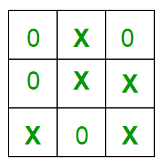

# Implementation of Tic Tac Toe Game in PYTHON 

## Rules of the Game:

1. The game is to be played between two people (in this program between HUMAN and COMPUTER).

2. One of the player chooses ‘O’ and the other ‘X’ to mark their respective cells.

3. The game starts with one of the players and the game ends when one of the players has one whole row/ column/ diagonal filled with his/her respective character (‘O’ or ‘X’).

4. If no one wins, then the game is said to be draw.

## Implementation:
In our program the moves taken by the computer and the human are chosen randomly. We use rand() function for this. What more can be done in the program? The program is in not played optimally by both sides because the moves are chosen randomly. The program can be easily modified so that both players play optimally (which will fall under the category of Artificial Intelligence). Also the program can be modified such that the user himself gives the input (using scanf() or cin). The above changes are left as an exercise to the readers.

## Winning Strategy – An Interesting Fact:
If both the players play optimally then it is destined that you will never lose (“although the match can still be drawn”). It doesn’t matter whether you play first or second.In another ways - “ Two expert players will always draw ”. Isn’t this interesting ? 

            Tic-Tac-Toe

Choose a cell numbered from 1 to 9 as below and play

              1 | 2  | 3  
            --------------
              4 | 5  | 6  
            --------------
              7 | 8  | 9  

-    -    -    -    -    -    -    -    -    -

COMPUTER has put a O in cell 6

                |    |    
            --------------
                |    | O  
            --------------
                |    |    

HUMAN has put a X in cell 7

                |    |    
            --------------
                |    | O  
            --------------
              X |    |    

COMPUTER has put a O in cell 5

                |    |    
            --------------
                | O  | O  
            --------------
              X |    |    

HUMAN has put a X in cell 1

              X |    |    
            --------------
                | O  | O  
            --------------
              X |    |    

COMPUTER has put a O in cell 9

              X |    |    
            --------------
                | O  | O  
            --------------
              X |    | O  

HUMAN has put a X in cell 8

              X |    |    
            --------------
                | O  | O  
            --------------
              X | X  | O  

COMPUTER has put a O in cell 4

              X |    |    
            --------------
              O | O  | O  
            --------------
              X | X  | O  

COMPUTER has won

## Software needed to run the code: VS Code

## Source: https://www.geeksforgeeks.org/implementation-of-tic-tac-toe-game/
